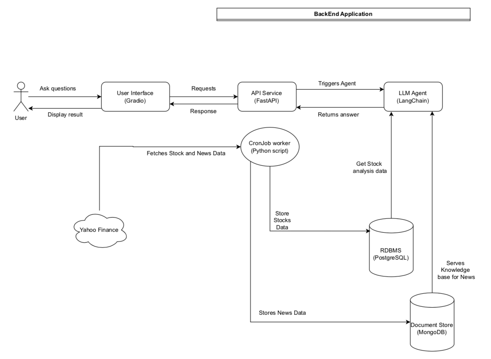
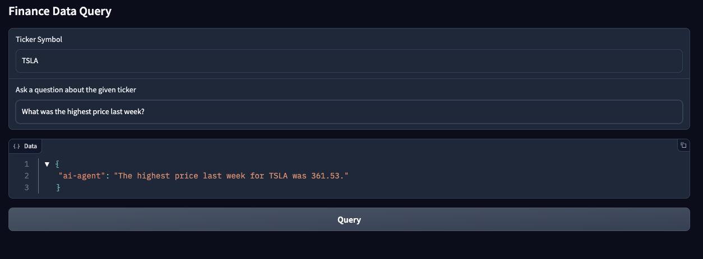

# Finance-AI-Agent

This repository contains a FastAPI application incorporating a LangChain Agent.
It utilses LLM model to answer queries on financial data analysis. 
 

## Table of Contents

- [Installation](#installation)
- [Usage](#usage)
- [System Architecture](#system-architecture)
- [UI Screenshot](#ui-screenshot)
- [Makefile Commands](#makefile-commands)

---

## Installation

1. Clone the repository:
   ```bash
   git clone https://github.com/prashantk1220/finance-ai-agent.git
   cd finance-ai-agent
   ```
   
2. Use the Makefile commands to Install all the required libraries.
   Prerequistie: The system should have Python3.9 or above installed. 
    ```
   make install
   ```
  

## Usage

Run the below command after the installation. 
Prerequisite: The database should be working and accepting connections on the port defined in env file.
```
make run
```

Launch the UI using another terminal with:
```
make ui
```

### Backend 
After running `make run`, the FastAPI backend is available at:
 * **Swagger UI**: http://127.0.0.1:8080/docs 
 
### UI 
After running `make ui`, the Gradio UI will be available at:
 * **Gradio UI**: http://127.0.0.1:7860”

Use the UI for your queries. 


## System Architecture

Below is the high-level system architecture of the project. For more details, refer to the [System Architecture Document](docs/component-diagram.pdf).




## UI Screenshots

Here are some working example screenshots of the Gradio-powered UI:

 


Makefile Commands 
-----------------

The `Makefile` simplifies common tasks for this project. Below is a list of the most important commands:

| Command         | Description                                           |
|-----------------|-------------------------------------------------------|
| `make install`  | Install all required dependencies.                    |
| `make test`     | Run the test suite using `pytest`.                    |
| `make run`      | Launch the FastAPI application.                       |
| `make ui`       | Start the Gradio UI.                                  |
| `make clean`    | Remove Python cache files and test artifacts.         |


Further Improvements 
----------------- 

- LLM Agent Prompts can be experimented for better results
- Additional Tools can be configured for the AI Agent
- Robust Integration tests
- The API can utilise caching for frequenetly queried data
